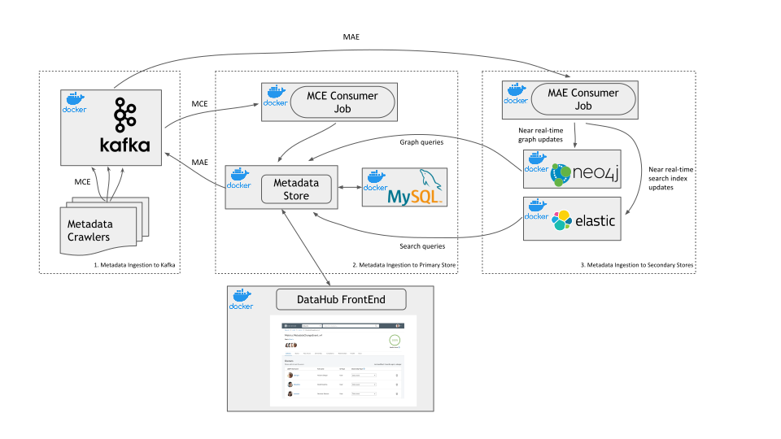
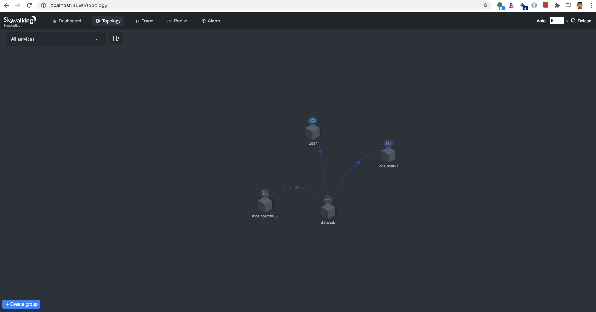
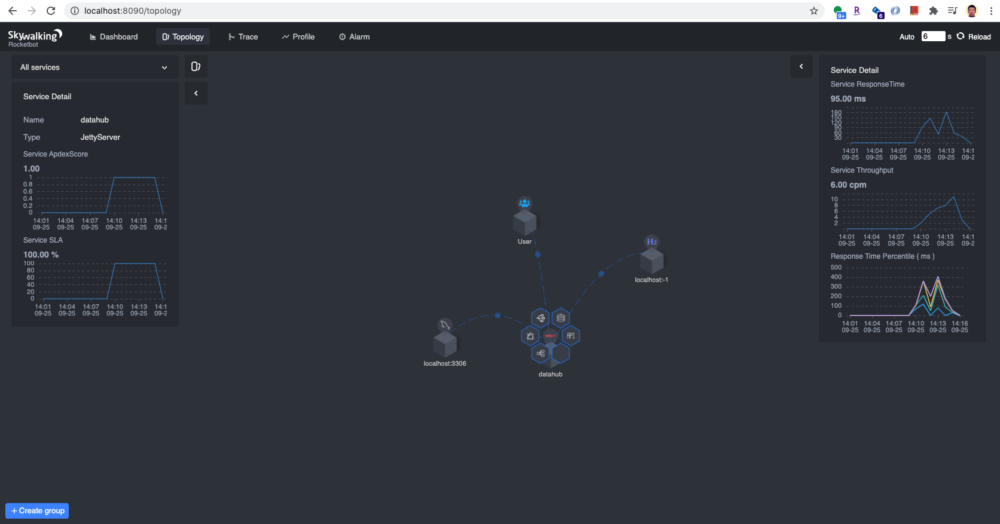
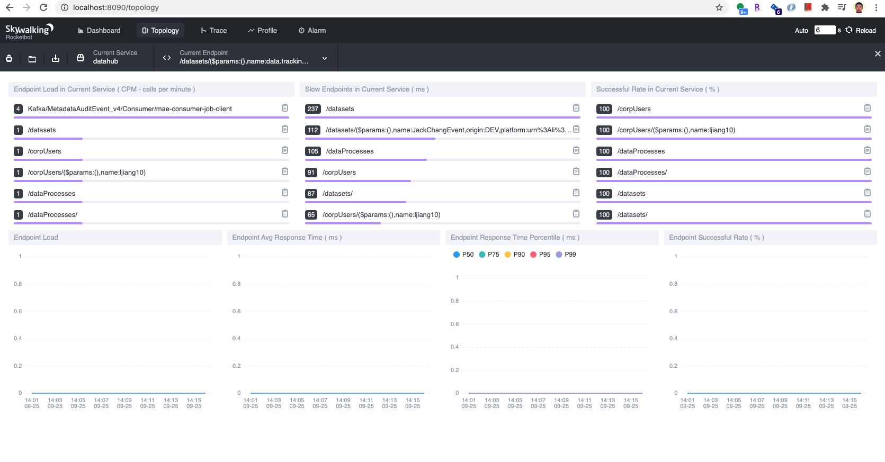
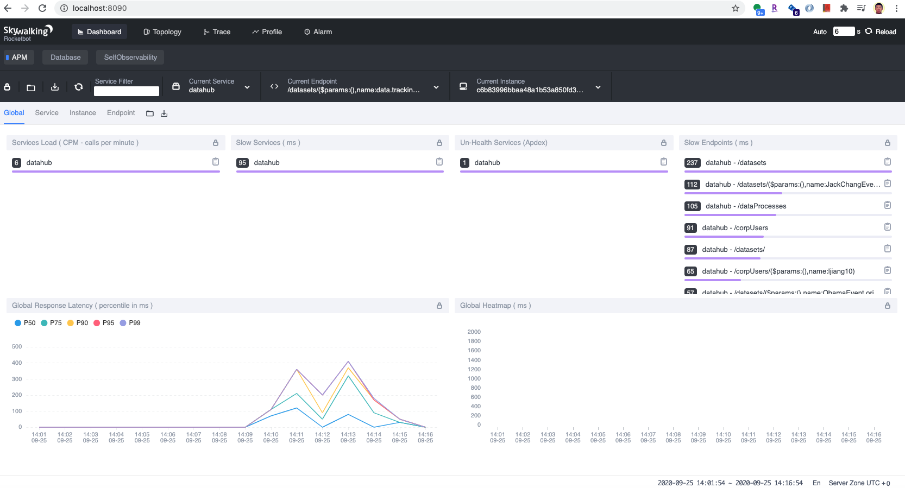
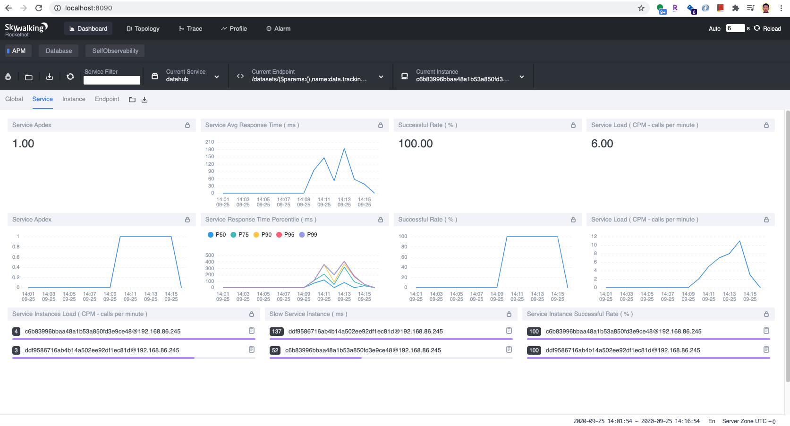
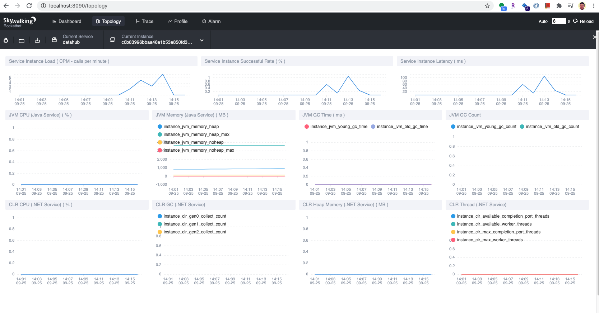
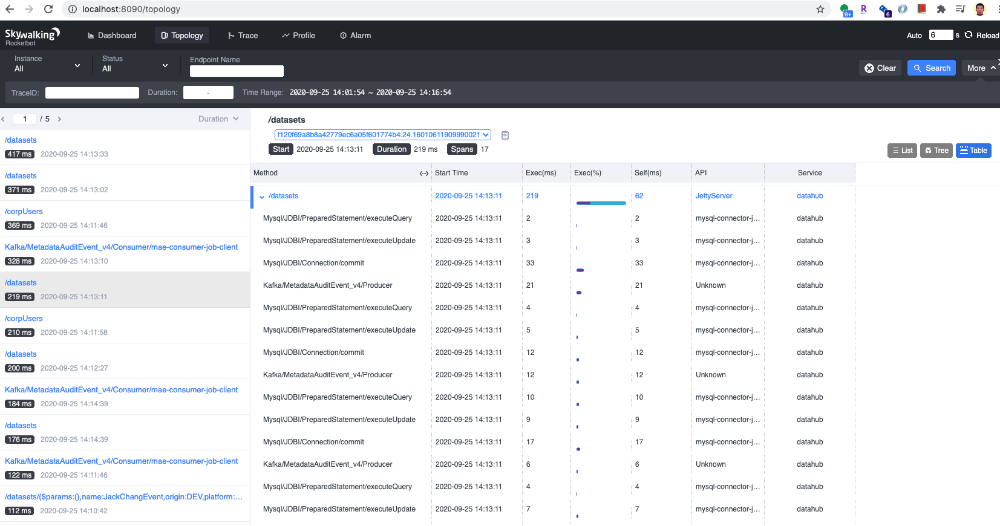
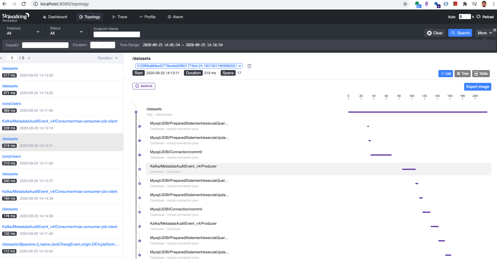
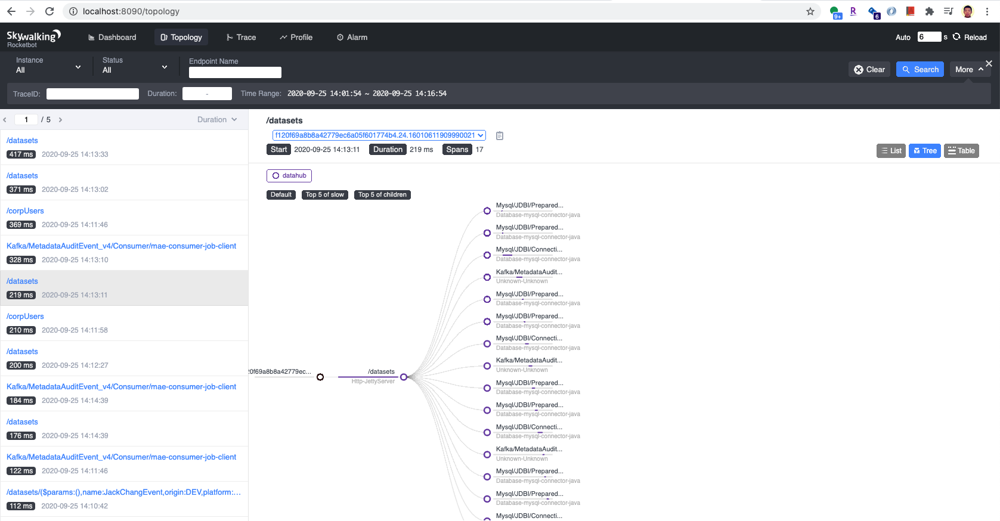

# Applicaiton Performance Monitor and Distrubted Tracing with Apache SkyWalking in Datahub 


## About Datahub
LinkedIn's open source project [Datahub](https://linkedin.github.io/datahub/) is a gneeralized metadata search & discovery tool. It has been gaining popularity lately. 
It has very nice architecture to support not only bring in metadata into this tool via event-driven approach, but also support metadata discovery and search in a restful way. 

As a summary, to use Datahub, you will use the following services. One type of service is that developed services, which consists of 
1. Datahub Frontend
2. GMS (Generalized Metadata Service) - think this as the main backend service
3. MCE Consumer Job - a Kafka consumer job to consume messages of MetadataChangeEvent(MCE) topic 
4. MAE Consumer Job - a Kafka consumer job to consumer messages of MetadataAuditEvent(MAE) topic

The other type service is leveraged services 
1. such as a relational database (MySQL, MariaDB, postgreSQL) 
2. Graph Database (Neo4j) 
3. Search Database (Elastic Search and its UI Kabana) 
4. Message Broker (Kafka and its related services such as Kafka, Schema Registry, Schema Registry UI) but it will be only one container. 

To get Datahub up and running, you will at least get those 8 services working. 
> If you have not tried Datahub, don't be scared. Datahub does provide [quickstart.sh](https://github.com/linkedin/datahub/blob/master/docker/quickstart.sh) to make the process easier. 

While deploy them into a production environment, or at least for your trial & error experiment, you might want to understand a little bit more about the peformance of Datahub.  

This is where Application Performance Monitor(APM) tool comes into the picture. Here we chosed [Apache SkyWalking](https://skywalking.apache.org/). The mission statement of Apache Skywalking is 
> Apache SkyWalking - Application performance monitor tool for distributed systems, especially designed for microservices, cloud native and container-based (Docker, K8s, Mesos) architectures

Why not [OpenTracing](https://opentracing.io/)? [Jaeger](https://www.jaegertracing.io/) ? [zipkin](https://zipkin.io/)? 

There are two things that affected my decision while I research this topic, also combining my experience with distributed tracking while working for Alibaba.
1. this Medium Article: [Distributed Tracing — we’ve been doing it wrong](https://medium.com/@copyconstruct/distributed-tracing-weve-been-doing-it-wrong-39fc92a857df)
2. The creator of SkyWalking, [Shen Wu](https://github.com/wu-sheng)'s talk: [Apache Skywalking, with Sheng Wu](https://www.youtube.com/watch?v=5dnNVz45jrA), and [this one in Chinese](https://www.bilibili.com/video/BV1qV41167tj)

There maybe  one reason for you to use Apache Skywalking - **it doesn't change single piece of your project to get it working with your project**.


## About Apache SkyWalking
Visting [SkyWalking's official website](https://skywalking.apache.org/) is the best way to know more about this project. 
As a summary, Skywalking works in this way
1. You deploy an Skywalking agent with your application
2. You run a Skwyalking backend (OAP) and UI to collect and analysis telemetry data Skywalking agent sends. You also need to have a ElasticSearch (ES) service to help Skywalking OAP. 

Datahub is developed with Java. You should download [Skywalking's agent for Java](http://skywalking.apache.org/downloads/). I also recommend that you at least read this Java agent [README.md](https://github.com/apache/skywalking/blob/v8.1.0/docs/en/setup/service-agent/java-agent/README.md) page to understand a little bit more what you will do. 

Once you download, you should follow the REAME.md to untar the binary, make a single modification in the `config/agent.config` to set `datahub` as your `agetn.service_name`

```
# The service name in UI
agent.service_name=${SW_AGENT_NAME:datahub}
```

**As a side note, I do find there are some issues while running Datahub modules with Skywalking agent enabled if I choose Skywalking's default configuration. I have to enable the following as well to make it working:**

```
# If true, SkyWalking agent will save all instrumented classes files in `/debugging` folder.
# SkyWalking team may ask for these files in order to resolve compatible problem.
agent.is_open_debugging_class = ${SW_AGENT_OPEN_DEBUG:true}

# If true, SkyWalking agent will cache all instrumented classes files to memory or disk files (decided by class cache mode),
# allow other javaagent to enhance those classes that enhanced by SkyWalking agent.
agent.is_cache_enhanced_class = ${SW_AGENT_CACHE_CLASS:true}

# The instrumented classes cache mode: MEMORY or FILE
# MEMORY: cache class bytes to memory, if instrumented classes is too many or too large, it may take up more memory
# FILE: cache class bytes in `/class-cache` folder, automatically clean up cached class files when the application exits
agent.class_cache_mode = ${SW_AGENT_CLASS_CACHE_MODE:MEMORY}
```

## Set up for Local Environment
In the following, we will discuss how to set up a local running LinkedIn's Datahub and a Skywalking backend and UI services. We will start measuring Datahub's performance with running the jars files of Datahub's service modules.  

### Set up LinkedIn's Datahub
Even though LinkedIn's [quickstart.sh](https://github.com/linkedin/datahub/blob/master/docker/quickstart.sh) will help you spin up each service listed above. But right now, we actually just want to start with MySQL, ES, Neo4j and Kafka and Kafka related services (Zookeeper, Schema Registry, Schema Registry UI, etc).

#### Run Docker container of MySQL, ES, Neo4j and Kafka
I do believe that Datahub is making it harder to run those services, compared to before. You can use [this](https://github.com/linkedin/datahub/blob/master/docs/docker/development.md) as a reference to understand the recommended way by them. 
LinkedIn's datahub is trying to give some flexibity for adapters not to limit to the default technology stack. I guess Flexbility alwyas comes with complexity. 
For this reason, I have included a `docker-compose` file: `docker-compose-mysql-es-neo4j-kafka.yml`. You run it in this way
> Keep in mind, you should run it under this project root, and you need to change the `init.sql` location in Line 17

```
docker-compose -f docker-compose-mysql-es-neo4j-kafka.yml up
```

There is a little extra work you need to do, create entity index manually. Move to `datahub/docker/elasticsearch-setup`
```
curl -XPUT http://localhost:9200/corpuserinfodocument  -H 'Content-Type: application/json' --data @corpuser-index-config.json && \
    curl -XPUT http://localhost:9200/dataprocessdocument  -H 'Content-Type: application/json' --data @dataprocess-index-config.json && \
    curl -XPUT http://localhost:9200/datasetdocument  -H 'Content-Type: application/json' --data @dataset-index-config.json
```


#### Run `GMS`, `mce-consumer-job` and `mae-consumer-job` locally 
> Not that hard, I promise. 
> I definitely made assumption that you are a develper and comfortable with Java development. 

1. Download [Datahub project from github](https://github.com/linkedin/datahub)
```
git clone git@github.com:linkedin/datahub.git
```

2. In the project root, run the following to build the project
```
./gradlew build
```

3. Find three files: 
1. gms' war file: `gms/war/build/libs/war.war`
2. mce-consumer-job's jar file: `metadata-jobs/mce-consumer-job/build/libs/mce-consumer-job.jar`
3. mae-consumer-job's jar file: `metadata-jobs/mae-consumer-job/build/libs/mae-consumer-job.jar`


### Set up Apache Skywalking OAP and UI
You might agree that the eaiser way to set up Apache Skywalking OAP and UI is using docker-compose. You can find the offical `SkyWalking-Docker` [here](https://github.com/apache/skywalking-docker)
It provides different combination of SkyWalking version and Elastic Search (ES) version. 
Here is an example of [Skywalking OAP 8.1.0 with ES 7](https://github.com/apache/skywalking-docker/blob/master/8/8.1.0/compose-es7/docker-compose.yml)
You might have realized, since both Datahub and Skywalking OAP are using ElasticSearch, it's better idea that you just want to spin up one Elastic Search.   
The simplest way to do so is that we remove Elastic Search (ES) service from SkyWalking's docker compose file, and make sure that the docker containers of Skywalking OAP and UI are the same network as Datahub. 
Also I have to change the skywalking UI's port to 8090 to avoid the conflict with the gms' service port of Datahub.

An sample modifide docker-compose.yml might look like, and you run it

```
version: '3.8'
services:
  oap:
    image: apache/skywalking-oap-server:8.1.0-es6
    container_name: oap
    # depends_on:
    #   - elasticsearch
    # links:
    #   - elasticsearch
    restart: always
    ports:
      - 11800:11800
      - 12800:12800
    healthcheck:
      test: ["CMD-SHELL", "/skywalking/bin/swctl"]
      interval: 30s
      timeout: 10s
      retries: 3
      start_period: 40s
    environment:
      SW_STORAGE: elasticsearch
      SW_STORAGE_ES_CLUSTER_NODES: elasticsearch:9200
      JAVA_OPTS: "-Xms2048m -Xmx2048m" 
  ui:
    image: apache/skywalking-ui:8.1.0
    container_name: ui
    depends_on:
      - oap
    links:
      - oap
    restart: always
    ports:
      - 8090:8080
    environment:
      SW_OAP_ADDRESS: oap:12800

volumes:
  data:
    driver: local

networks:
  default:
    name: datahub_network  

```

Also you run the following to get it going

```
docker-compose -f docker-compose-skywalking-oap-ui.yml up
```


### Start the application performance measurement 
You can start the `gms`, `mce-consumer-job` and `mae-consumer-job` with Skywalking Java agent in the following way
1. Start up `gms`
`gms` is a Spring application. It works with `jetty-runner`. Let's download the `jetty-runner`, and put it with `war.war` file of `gms`. Assumed you are in the `gms`' `war.war` directory

```
curl https://repo1.maven.org/maven2/org/eclipse/jetty/jetty-runner/9.4.20.v20190813/jetty-runner-9.4.20.v20190813.jar --output jetty-runner.jar
```

```
java -javaagent:/YOUR-SKYWALKING-AGENT-DOWNLOAD-PATH/apache-skywalking-apm-bin/agent/skywalking-agent.jar -jar ./jetty-runner.jar ./war.war  
```

2. Start up `mce-consumer-job`
```
java -javaagent:/YOUR-SKYWALKING-AGENT-DOWNLOAD-PATH/apache-skywalking-apm-bin/agent/skywalking-agent.jar -jar ./mce-consumer-job.jar
```

3. Start up `mae-consumer-job`
```
java -javaagent:/YOUR-SKYWALKING-AGENT-DOWNLOAD-PATH/apache-skywalking-apm-bin/agent/skywalking-agent.jar -jar ./mae-consumer-job.jar
```

4. Run some API requests
There are some sample `cUrl` commands to create `dataset`, `corpuser`, `corpgroup`, `get a user` etc if you can find them in the [gms module documentation](https://github.com/linkedin/datahub/tree/master/gms).

If you are a fan of [postman](https://www.postman.com/). I also added a postman json file for your convenience. Start making requests. More, better

Keep in mind, it will take at least 3-5 mins that you can see some result at Skywalking UI http://localhost:8090


## Understand the Skywalking UI
1. My favorite starting point is from Topology

2. Click the datahub service, you can get some details 

3. Click each buttons to get some information such as endpoints and tracers

4. For sure, you can start from global view

5. or you can look at service

6. or more


7. endpoint can be shown in table, list and tree view
    * Table view

    * List view


    * Tree view


I leave you to interpret the numbers shown on each screenshot.

Skywalking also provides features such as profile and alarm. I leave you to explore.


## Set up for Docker Images
Set up Apache Skywalking Java agent with the module's docker image of Datahub is pretty similar to steps above. We briefly use `gms` [Dockerfile](https://github.com/linkedin/datahub/blob/master/docker/datahub-gms/Dockerfile) as an example

In line [#8](https://github.com/linkedin/datahub/blob/master/docker/datahub-gms/Dockerfile), let's add downloading Skywalking Java agent and untar it. 

In [start.sh](https://github.com/linkedin/datahub/blob/master/docker/datahub-gms/start.sh), we need to work on modifying Skywalking's config file a little bit.

In [line #9 of start.sh](https://github.com/linkedin/datahub/blob/master/docker/datahub-gms/start.sh), we changed it to
```
java -javaagent:/YOUR-SKYWALKING-AGENT-DOWNLOAD-PATH/apache-skywalking-apm-bin/agent/skywalking-agent.jar -jar ./jetty-runner.jar ./war.war
```
